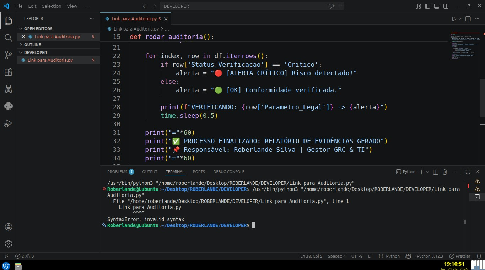

# 🏛️ Hub de Conformidade e Engenharia de Software

> **Especialista:** Roberlande Silva 
> `Direito Administrativo` | `Engenharia de Software` | `Governança de TI`

&nbsp;&nbsp;&nbsp;&nbsp;&nbsp;&nbsp;

---

## ⚖️ Governança e Compliance Digital

Este repositório é uma implementação prática de **Compliance-by-Design**. Aqui, a norma jurídica é integrada diretamente ao fluxo de dados para garantir segurança, integridade e transparência na gestão pública.

### 🛡️ Fundamentação Legal
O projeto está estruturado sob os pilares da **Lei nº 14.133/2021 (Nova Lei de Licitações)** e da **LGPD (Lei nº 13.709/2018)**, focando em:
* **Segregação de Funções:** Prevenção automática de conflitos de interesse.
* **Auditabilidade:** Rastro técnico em todos os processos de decisão.
* **Gestão de Riscos:** Matrizes automatizadas que antecipam falhas de governança.

### 🤖 2. Inteligência e Automação
Para garantir a integridade dos dados, desenvolvi um script de auditoria que valida os controles em tempo real.

* 📁 [Acessar Código-Fonte do Script](scripts/auditoria_automatizada.py) — *Para análise técnica da lógica em Python.*
* 📸 **Evidência de Execução:**

### 🚀 Artefatos de Valor (Neste Repositório)
* 📑 **[Matriz de Riscos Avançada](documentos-conformidade/auditoria_detalhada_software.csv):** Auditoria técnica de 20+ pontos de controle.
* 🛡️ **[Plano de Governança](documentos-conformidade/plano_estrategico_governanca.md):** Estratégia de mitigação de riscos críticos.
* 🏗️ **[Compliance-by-Design](fluxogramas-bpmn/arquitetura_conformidade_digital.md):** Manifesto de arquitetura pública.

---

*Projeto desenvolvido por Roberlande Silva, unindo Direito Administrativo e Engenharia de Software.*
